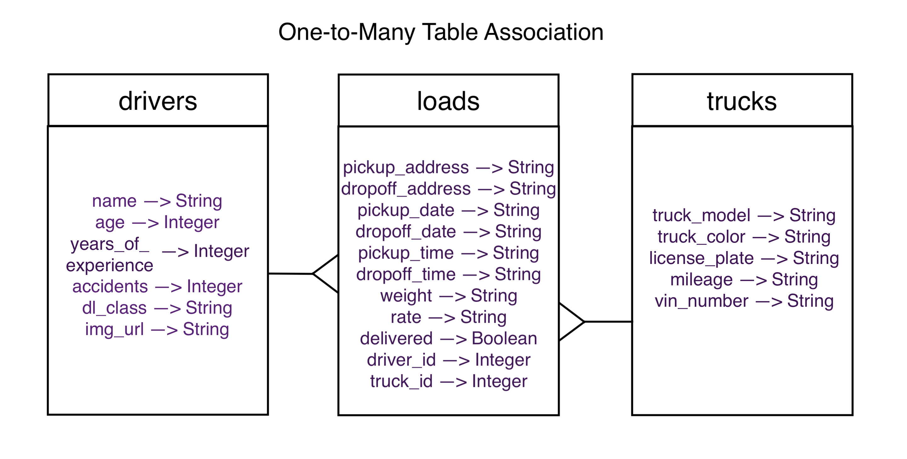

# Created with:  

    

### Deployment:

# Freight Management
This application consists of a web API built with Sinatra and Active Record in connection with a React frontend.

# Usage

## Front-end
On the client side (from root directory './freight-management-client'), the application allows you to add, remove and manage data of a freight company.

## Back-end
On the server side (from root directory './freight-management-server'), you can decide to start the application without data, running only the migrations to create the database tables:

$ bundle exec rake db:migrate

In case you wish to migrate the tables with some sample data, just run the following command:

$ bundle exec rake db:migrate db:seed

The database tables communicate with eachother through a one-to-many table association relationship, represented below:

# File Structure

### Navigating

### Contribute

## Support
For any questions related to the project's functionality, code, or usage, please reach out to:  
brasildu@gmail.com
