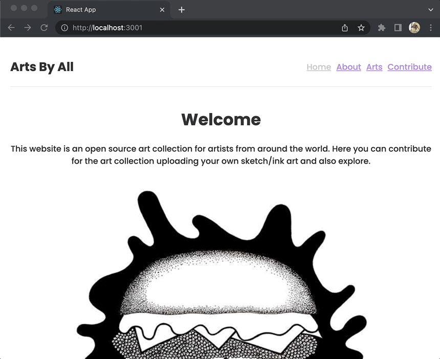
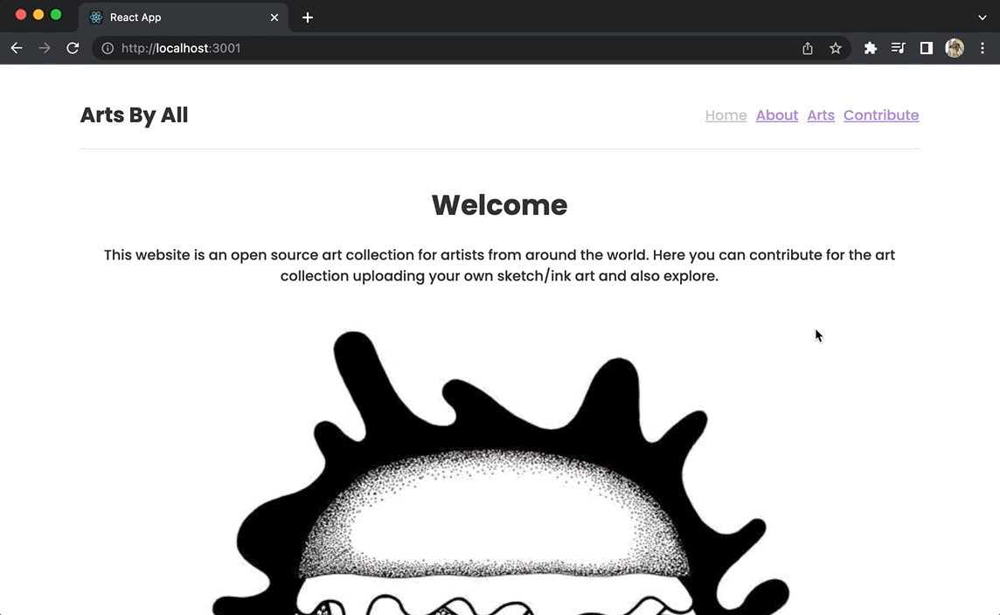

Created with:  

   

# Arts By All

Arts By All is a single page web application created with React. It is an open source art collection where you can explore and upload arts, contributing to the collection.

## Dependencies
-Packages:
$ npm install

-JSON server:
$ npm install -g json-server

Make sure to have the script in package.json file --> "server": "json-server --watch db.json --port 3004"
Then type on terminal:
$ npm run server

-React Router:
$ npm install react-router-dom@5

## Usage
This project utilizes client-side routing, making the user able to interact with links to change URLs and have the UI updated. Along with it, a form is made avaible to the user through the Contribute link, in order to upload arts that will be added to the art collection
  
For a walkthrough of the project web page, check out the YouTube video:
https://www.youtube.com/watch?v=CzPgnsIEIQo
  
### Navigating
There are 4 navbar links on the top right of the page which the user can interact with to render different types of content. Once the web page is loaded, the user will be able to see:  

### Arts collection
Once the user clicks on the Arts link, an art collection is rendered. If the user clicks on top of an art card, more details about the art will be displayed:

 

### Contribute
The contribute link renders a form which the user can upload an art filling up the requested information and submit:  

Once the art is submitted, the user is able to check the art clicking on the Arts link that takes to the art collection.  

## Support
For any questions related to the project's functionality, code, or usage, please reach out to:  
brasildu@gmail.com
